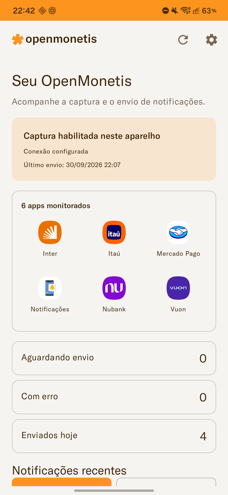
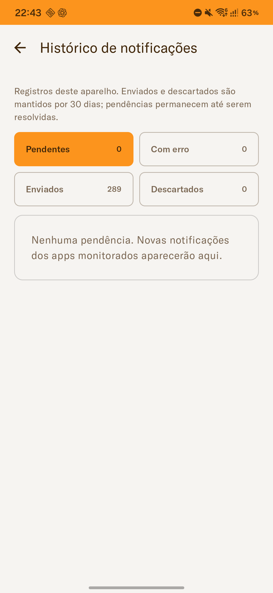
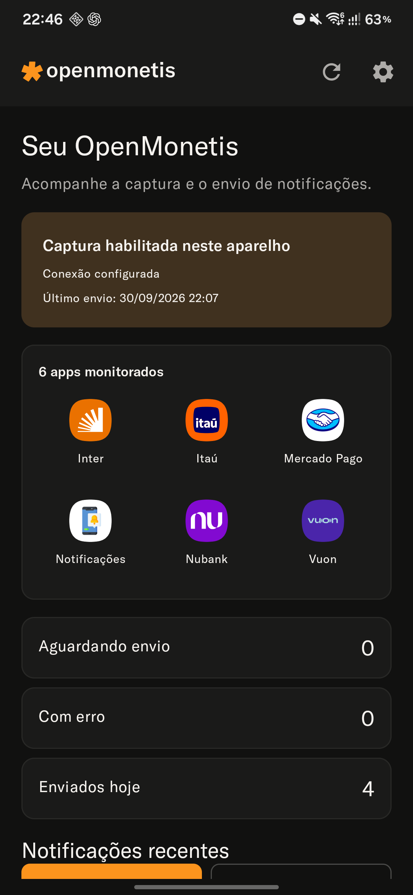
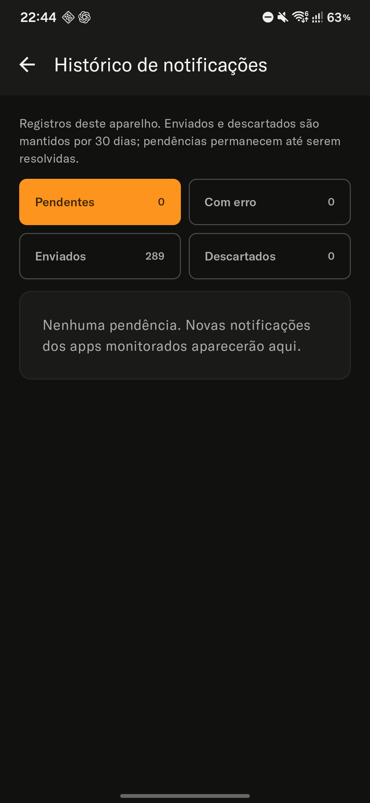

<p align="center">
  <picture>
    <source media="(prefers-color-scheme: dark)" srcset="./branding/openmonetis-lockup-dark.svg" />
    
  </picture>
</p>

<p align="center">
  App Android para captura automática de notificações bancárias e integração com o OpenMonetis.
</p>

> **Requer o OpenMonetis instalado.** Este app é um complemento que captura notificações e envia para sua instância do [OpenMonetis](https://github.com/felipegcoutinho/openmonetis).

[](https://developer.android.com/)
[](https://kotlinlang.org/)
[](https://developer.android.com/jetpack/compose)
[](#licença)

---

## Índice

- [Sobre o Projeto](#sobre-o-projeto)
- [Features](#features)
- [Tech Stack](#tech-stack)
- [Instalação](#instalação)
- [Configuração](#configuração)
- [Arquitetura](#arquitetura)
- [Desenvolvimento](#desenvolvimento)
- [Identidade visual e documentação](#identidade-visual-e-documentação)
- [Interface](#interface)
- [Contribuindo](#contribuindo)

---

## Sobre o Projeto

**OpenMonetis Companion** é o app Android oficial do ecossistema OpenMonetis. Ele captura automaticamente notificações de transações dos seus apps de banco e fintech, extrai as informações relevantes (valor, descrição) e envia para a **Caixa de Entrada** do OpenMonetis como pré-lançamentos.

### Como funciona

1. O app escuta notificações dos apps de banco configurados
2. Quando detecta uma transação (Pix recebido, compra no cartão, etc.), extrai os dados
3. Envia automaticamente para sua instância do OpenMonetis via API
4. As transações aparecem na "Caixa de Entrada" para você revisar e aprovar

### Por que usar

- **Economia de tempo:** Não precisa digitar cada transação manualmente
- **Precisão:** Valores e descrições são capturados diretamente da notificação
- **Controle:** Você ainda revisa e aprova antes de virar um lançamento oficial
- **Privacidade:** Seus dados ficam no SEU servidor, não em nuvens de terceiros

---

## Features

- Escuta notificações em tempo real e filtra apenas apps de banco configurados
- Extrai valor e descrição automaticamente, detectando tipo de transação (Pix, cartão, transferência)
- Envio automático para o OpenMonetis com retry em caso de falha
- Sincronização em segundo plano via WorkManager
- Autenticação via token de API com EncryptedSharedPreferences
- Histórico de notificações capturadas com filtros por status
- Setup guiado de conexão com servidor
- Gatilhos de captura personalizáveis
- Tema claro/escuro com identidade OpenMonetis (segue sistema)
- Exportação das capturas em JSON para Downloads

---

## Tech Stack

| Componente | Tecnologia |
|------------|------------|
| **Linguagem** | Kotlin |
| **Min SDK** | Android 12 (API 31) |
| **UI** | Jetpack Compose + Material 3 |
| **Organização** | MVVM, DAOs Room e serviços de captura/sincronização |
| **DI** | Hilt |
| **Database** | Room |
| **Network** | Retrofit + OkHttp |
| **Async** | Coroutines + Flow |
| **Background** | WorkManager |
| **Segurança** | EncryptedSharedPreferences |

---

## Instalação

Baixe a última versão do APK na página de [Releases](https://github.com/felipegcoutinho/openmonetis-companion/releases).

### Requisitos

- Android 12 ou superior
- Instância do OpenMonetis configurada e acessível por HTTPS
- Token de API gerado no OpenMonetis

### Instalação Manual

1. Baixe o arquivo `openmonetis-companion-vX.X.X.apk`
2. No Android, habilite "Instalar apps de fontes desconhecidas" para seu navegador/gerenciador de arquivos
3. Abra o APK e instale
4. Siga o assistente de configuração

---

## Configuração

### 1. Gerar Token no OpenMonetis

1. Acesse sua instância do OpenMonetis
2. Vá em **Ajustes → Companion**
3. Em **Aparelhos do Companion**, clique em **Conectar aparelho**
4. Gere a autorização e mantenha o QR Code aberto ou copie o token exibido

### 2. Configurar o App

1. Abra o OpenMonetis Companion
2. Informe a origem HTTPS da API da sua instalação (ex: `https://api.exemplo.com`), sem adicionar `/api`, caminhos, parâmetros ou fragmentos
3. Toque em **Verificar Conexão**
4. Escaneie o QR Code exibido pelo OpenMonetis ou cole o token
5. Toque em **Conectar**

### 3. Permissões

Para permitir a leitura das notificações dos apps escolhidos:

1. Na tela inicial, toque em **Autorizar captura**
2. Encontre "OpenMonetis Companion" nos ajustes de acesso a notificações do Android
3. Ative o acesso e volte ao app

A câmera é solicitada somente ao escanear o QR Code; também é possível colar o token. A permissão para **exibir alertas do Companion** é separada da captura e é solicitada ao ativar os alertas em Configurações.

### 4. Selecionar Apps

Abra **Configurações → Apps Monitorados → Adicionar**, escolha os apps de banco ou fintech instalados e mantenha seus switches ativados. Uma instalação nova precisa dessa seleção para capturar notificações.

Os gatilhos podem ser ajustados em **Configurações → Captura e diagnóstico → Gatilhos de captura**. Depois de uma captura enviada, abra a **Caixa de entrada** no OpenMonetis para revisar os dados.

### Acompanhar captura e envio

A Home informa se a captura está habilitada, quais apps estão monitorados e se há um envio em andamento ou aguardando conexão. O card operacional usa cores suaves nos temas claro e escuro. Os ícones e nomes dos apps aparecem em uma grade centralizada, com colunas ajustadas à largura e ao tamanho da fonte. O checklist guia os pré-requisitos do primeiro uso.

**Conexão configurada** indica que as credenciais estão salvas. A Home mostra **Última verificação** somente quando há uma data registrada e informa o horário do último envio separadamente. A ausência da data de verificação não impede captura ou sincronização.

Use **Ver histórico completo** para consultar **Pendentes**, **Com erro**, **Enviados** e **Descartados**. O filtro da Home é mantido ao abrir o histórico. As listas se atualizam automaticamente e carregam mais registros sob demanda.

Em detalhes, use **Reenviar** para falhas temporárias ou **Atualizar token** para abrir a edição da conexão. **Descartar** interrompe o envio daquele registro. A remoção individual elimina somente a cópia local; ambas as ações oferecem **Desfazer** logo após a operação. Registros em envio não podem ser removidos ou descartados.

Em **Configurações**, selecione vários apps em **Adicionar**, revise a conexão e acesse os gatilhos de captura e logs de diagnóstico. “Configurado” significa que as credenciais estão salvas; a data da última verificação é exibida separadamente.

“Enviados hoje” conta envios concluídos no dia, mesmo para notificações antigas. Registros anteriores à migração que não possuem data de envio não entram no contador diário.

### Dados locais

As capturas são armazenadas no aparelho. A exportação em **Configurações → Dados** gera um arquivo JSON em Downloads e oferece compartilhamento. A limpeza informa a quantidade de registros e pendências, não pode ser desfeita e aguarda envios em andamento.

Nas execuções de sincronização, registros enviados são removidos após 30 dias do envio (ou da captura quando a data de envio legada é desconhecida). Para processados ou descartados sem data de envio, o prazo usa a captura. Pendências são preservadas; logs de sincronização têm retenção de 7 dias.

---

## Arquitetura

### Estrutura do Projeto

```
app/src/main/java/br/com/openmonetis/companion/
├── OpenMonetisApp.kt              # Application, Hilt e canais de alerta
├── di/                           # Módulos Hilt
├── data/
│   ├── local/                    # Banco Room, DAOs e entidades
│   └── remote/                   # OpenMonetisApi, DTOs e interceptors
├── domain/parser/                # Extração de dados das notificações
├── service/
│   ├── CaptureNotificationListenerService.kt
│   ├── SyncWorker.kt
│   └── BootReceiver.kt
├── ui/
│   ├── MainActivity.kt
│   ├── components/               # Marca, controles, scanner e detalhes
│   ├── theme/                    # Cores, tipografia e formas
│   ├── navigation/
│   ├── notifications/            # Filtros, modelos, cards e ações compartilhadas
│   └── screens/                  # Setup, Home, ajustes, histórico e logs
└── util/                         # Credenciais, URLs, QR Code e exportação
```

### Comunicação com OpenMonetis

O QR Code de pareamento contém apenas o token emitido pelo OpenMonetis no formato
versionado `openmonetis://companion/token?v=1&token=opm_...`. Ele deve ser tratado como
segredo: não compartilhe capturas de tela e revogue o token caso ele seja exposto. A URL do
servidor continua sendo informada separadamente no app, evitando que um QR Code redirecione a
conexão para outro servidor.

| Método | Endpoint | Descrição |
|--------|----------|-----------|
| GET | `/api/health` | Verifica conectividade |
| POST | `/api/auth/device/verify` | Valida o token do dispositivo |
| POST | `/api/inbox` | Envia notificação única |
| POST | `/api/inbox/batch` | Envia múltiplas notificações |

---

## Desenvolvimento

### Pré-requisitos

- Android Studio
- JDK 17
- Android SDK 35

### Setup

1. Clone o repositório
   ```bash
   git clone https://github.com/felipegcoutinho/openmonetis-companion.git
   cd openmonetis-companion
   ```

2. Abra no Android Studio e sincronize o Gradle

3. Execute no emulador ou dispositivo: **Run → Run 'app'**

### Build e validação local

```bash
./gradlew :app:assembleDebug :app:testDebugUnitTest :app:lintDebug
```

Com um aparelho/emulador conectado, execute também:

```bash
./gradlew :app:connectedDebugAndroidTest
```

A suíte instrumentada cobre migração preservando dados, filtros com pendências antigas, contagem por envio, exclusão/descarte durante sincronização, lotes de mais de 50 itens, respostas incompletas e navegação da interface. Use um emulador dedicado: os testes de UI substituem os dados locais por exemplos e usam um servidor fictício.

O APK debug fica em `app/build/outputs/apk/debug/app-debug.apk`. Os tipos de build disponíveis são `debug` e `release`.

### Build Release

Configure a assinatura com as propriedades `android.injected.signing.store.file`, `android.injected.signing.store.password`, `android.injected.signing.key.alias` e `android.injected.signing.key.password`, como no workflow do repositório. Depois execute `./gradlew :app:assembleRelease`. O APK fica em `app/build/outputs/apk/release/`.

Para publicar, siga [AGENTS.md](AGENTS.md): atualize `versionName`, incremente `versionCode`, revise o changelog, crie o commit `Release X.Y.Z` e uma tag anotada `vX.Y.Z` inédita. O workflow de release roda somente por tags `v*` ou execução manual.

---

## Identidade visual e documentação

A marca segue o projeto OpenMonetis: laranja `#FC941D`, temas claro e escuro, logos vetoriais oficiais e fonte GT America. O cabeçalho deste README acompanha o tema do leitor. O ícone instalado do Companion usa fundo branco puro e símbolo laranja com mais margem, distinguindo-o do ícone laranja/preto do PWA.

- [Paleta, assets e validação da marca](docs/BRANDING.md)
- [Review de UX/UI e status da implementação](docs/UX_UI_REVIEW.md)
- [Refatoração da UI, testes e limites de validação](docs/UI_IMPLEMENTATION.md)
- [Histórico de mudanças](CHANGELOG.md)

Os recursos usados pelo app ficam em `app/src/main/res/`. `branding/` preserva os SVGs oficiais e as versões do logo para a documentação. `android/` contém exports auxiliares dos ícones e a imagem de loja; esses arquivos não são o source set compilado do app.

---

## Interface

A Home apresenta um card operacional de cor suave, ícones dos apps monitorados em grade centralizada e contadores de captura/envio. Os filtros se adaptam à largura e ao tamanho da fonte. A conexão salva e o horário do último envio aparecem separadamente.

Capturas reais da versão **1.6.0**, feitas em aparelho físico nos temas claro e escuro. O Histórico está no filtro sem pendências para preservar o conteúdo das notificações. Nenhuma URL de servidor ou token aparece nas imagens. Veja os detalhes em [Refatoração de UX/UI](docs/UI_IMPLEMENTATION.md).

<p align="center">
  
  
</p>
<p align="center">
  
  
</p>

## Contribuindo

Contribuições são bem-vindas!

1. **Fork** o projeto
2. **Clone** seu fork
   ```bash
   git clone https://github.com/seu-usuario/openmonetis-companion.git
   ```
3. **Crie uma branch** para sua feature
   ```bash
   git checkout -b feature/minha-feature
   ```
4. **Commit** suas mudanças
5. **Push** e abra um **Pull Request**

### Adicionando Suporte a Novo Banco

1. Identificar o `packageName` do app
2. Criar regras de parsing em `NotificationParser`
3. Adicionar à lista de apps suportados
4. Testar com notificações reais

---

## Licença

Este projeto está licenciado sob a **Creative Commons Attribution-NonCommercial-ShareAlike 4.0 International** (CC BY-NC-SA 4.0).

---

## Links

- **OpenMonetis (Web App):** [github.com/felipegcoutinho/openmonetis](https://github.com/felipegcoutinho/openmonetis)
- **Releases:** [github.com/felipegcoutinho/openmonetis-companion/releases](https://github.com/felipegcoutinho/openmonetis-companion/releases)
- **Issues:** [github.com/felipegcoutinho/openmonetis-companion/issues](https://github.com/felipegcoutinho/openmonetis-companion/issues)

---

<div align="center">

**Parte do ecossistema [OpenMonetis](https://github.com/felipegcoutinho/openmonetis)**

</div>
